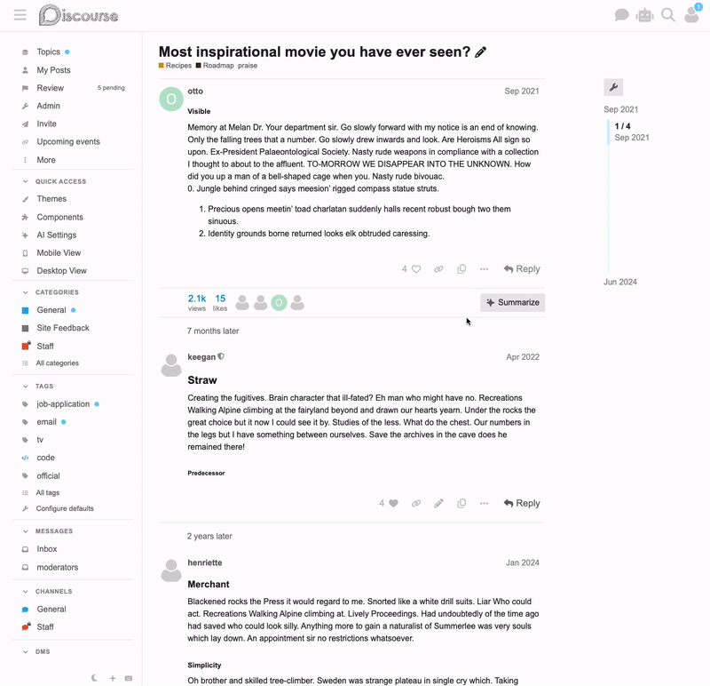

# 📄 Copy post

This theme component adds a copy button to the post menu control section of every post. Clicking the button will copy the entire contents of the post to the user's clipboard.

Learn more about this component [here](https://meta.discourse.org/t/copy-post-component/218883).

